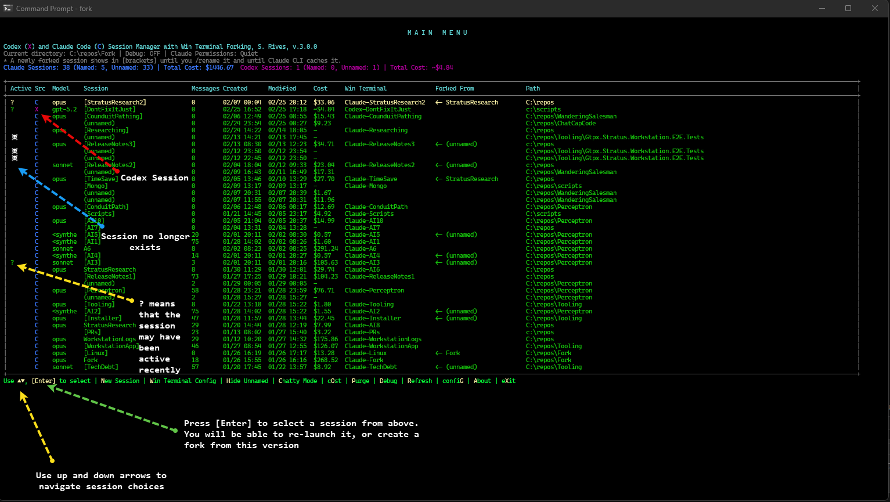
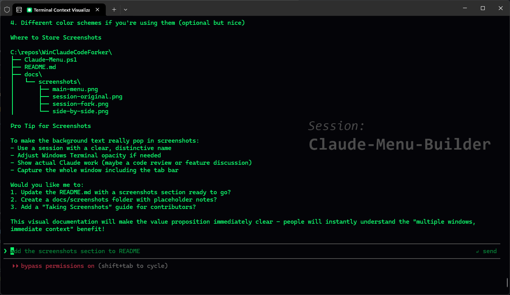

# SessionForge (sf) v3.1.0

A unified visual session manager for both Claude Code CLI and OpenAI Codex CLI with fork/continue workflows and background watermarks.

| Platform | Status | Terminal Support | CLI Support |
|----------|--------|------------------|-------------|
| **Windows** | ✅ Stable | Windows Terminal | Claude Code, Codex |
| **Linux** | 🚧 In Progress | Kitty, Konsole, WSL | Claude Code, Codex |

---

## Windows Version
A unified session manager for Claude Code and Codex CLI on Windows Terminal.
Download **[SessionForge.exe](https://github.com/srives/SessionForge/releases)**

> **Unified session management for Claude Code and Codex CLI**
> Never lose track of your conversations. See all Claude and Codex sessions in one menu, fork with confidence, track your costs.




---

## 🎯 The Problem

Working with multiple Claude Code and Codex sessions across different projects? Can't remember which terminal is which? No visual way to track your conversations? Wondering how much you're spending on API calls across both CLIs?

## ✨ The Solution

**SessionForge** gives you a unified dashboard for all your AI coding sessions:
- 🔀 **Unified multi-CLI dashboard** -- see all Claude and Codex sessions in one menu
- 📋 See all sessions at a glance with sortable columns and color-coded Src column
- 🍴 Fork conversations with custom Windows Terminal backgrounds
- 💰 Track costs per session with detailed analytics (both CLIs)
- 🌿 Git branch awareness in every session
- ⚡ Lightning-fast arrow-key navigation
- 🎨 Custom backgrounds showing session context (works for both Claude and Codex)


*Each forked session gets a unique background: session name, parent, git branch, and model*

---

## 🚀 Quick Install

### Option 1: Installer (Recommended)
1. Download **[SessionForge.exe](https://github.com/srives/SessionForge/releases)**
2. Run the installer
3. Launch "SessionForge" from your desktop

### Option 2: Manual Install
```powershell
# Create directory
New-Item -ItemType Directory -Path "$env:USERPROFILE\.claude-menu" -Force

# Copy script
Copy-Item "Claude-Menu.ps1" "$env:USERPROFILE\.claude-menu\"

# Create desktop shortcut
$WshShell = New-Object -ComObject WScript.Shell
$Shortcut = $WshShell.CreateShortcut("$env:USERPROFILE\Desktop\SessionForge.lnk")
$Shortcut.TargetPath = "powershell.exe"
$Shortcut.Arguments = "-ExecutionPolicy Bypass -File `"$env:USERPROFILE\.claude-menu\Claude-Menu.ps1`""
$Shortcut.Save()
```

**Requirements:**
- Windows 10/11
- PowerShell 5.1+
- Windows Terminal
- Claude Code CLI
- OpenAI Codex CLI (optional -- for unified Codex session management)
- Python (optional -- required on Windows for Codex SQLite reading)

---

## 💡 Key Features

### Session Management
- **All Sessions Visible** - Scans your entire drive for Claude and Codex sessions
- **Fork with Context** - Branch conversations with custom Windows Terminal profiles
- **Archive & Notes** - Tag sessions with notes, archive old conversations
- **Rename Anytime** - Rename sessions and update all references automatically

### Visual Intelligence
- **Custom Backgrounds** - Each Claude or Codex fork gets a unique background showing:
  - Session name
  - Parent session (if forked)
  - Git branch
  - AI model (Opus/Sonnet/Haiku)
  - Project directory
- **Activity Markers** - See which sessions are active at a glance
- **Git Integration** - Automatically detects and displays git branches

### Cost & Token Tracking
- **Token Totals Front & Center** - Header shows per-platform cost and token total (e.g., `Cost: $1,485.63, Tokens: 2.7B`)
- **Per-Session Costs** - See exactly how much each conversation costs
- **Token Analytics** - Track input, output, and cache usage
- **Cache Hit Rates** - Monitor prompt caching effectiveness
- **Persistent Cost History** - Cost snapshots survive session purging via `costing.json`; lifetime totals in cost analysis

### Professional UX
- **Arrow Navigation** - Instant keyboard navigation with ↑↓ keys
- **Dynamic Columns** - Customize which columns appear (11 configurable columns)
- **Pagination** - Handle hundreds of sessions with screen-aware pagination
- **Universal Defaults** - Press Enter for default action in any menu
- **Silent Validation** - 250 automated tests protect against bugs (results copyable to clipboard)

---

## ⌨️ Quick Start

### Launch & Navigate
```
Launch → See all Claude and Codex sessions → Use ↑↓ to navigate → Press Enter
```

---

## 🔧 Advanced Features

### Column Configuration
Press **G** to customize which columns appear.
Press 1, 2, 3, etc. to sort by the Nth visible column.

### Purge Dead Sessions
Press **P** to scan for sessions whose conversation files no longer exist on disk. Dead sessions show a skull (☠) in the Active column. Purge lets you bulk archive or bulk delete them.

### co$t Menu
Press **$** to toggle the cost column on/off. Hiding costs skips all .jsonl parsing for instant load. When ON, costs and token totals are calculated with a progress bar, cached, and displayed per platform in the header (e.g., `Cost: $1,485.63, Tokens: 2.7B`).

### Validation System
Built-in self-protection with 250 automated tests (copy results to clipboard)

---

## 🐛 Troubleshooting

**Sessions not appearing?**
- Press `R` to refresh
- Enable debug mode with `D`
- Check `~\.claude-menu\debug.log`
  Under Debug, you can notepad the debug.log

**Background images not showing?**
- Open Windows Terminal Settings
- Select your Claude profile
- Check Background Image path and opacity (30%)
- Disable Acrylic effects if enabled

**Script won't run?**
```powershell
powershell -ExecutionPolicy Bypass -File "Claude-Menu.ps1"
```

**Need more help?**
- Check [Full Documentation](docs/README-FULL.md)
- Review [Changelog](docs/CHANGELOG.md)
- Open an issue on GitHub

---

## 📚 Documentation

- **[Quick Start Guide](docs/QUICKSTART.md)** - Get running in 2 minutes
- **[Full Documentation](docs/README-FULL.md)** - Complete feature reference
- **[Installation Guide](docs/INSTALL.md)** - Detailed setup instructions
- **[Changelog](docs/CHANGELOG.md)** - Version history
- **[Product Analysis](docs/PRODUCT_ANALYSIS.md)** - Development insights

---

## 💎 What Makes This Special

### Visual Watermarks on Every Session

Each Windows Terminal profile gets a **custom background watermark** showing:
- **Session name** (large, readable at a glance)
- **Parent session** (if forked)
- **Git branch** (always know which branch you're on)
- **AI model** (Opus/Sonnet/Haiku)
- **Directory path** (never lose context)


*Subtle watermark keeps you oriented without obscuring your work*

### Professional Quality
- **Enterprise-grade UX** - Arrow navigation, silent input handling, universal defaults
- **250 Automated Tests** - Self-validating code protects against regressions (results copyable to clipboard)
- **Comprehensive Error Handling** - Graceful recovery from failures
- **Performance Optimized** - Caching, pagination, instant response; co$t menu ($) toggles cost column for instant load when off

### Unique Features
- **Only unified session manager for both Claude Code and Codex** -- one menu for all your AI coding sessions
- **Cost tracking** per session (know exactly what each conversation costs, both CLIs)
- **Visual fork tracking** with custom watermark backgrounds
- **Windows Terminal deep integration** (profiles, backgrounds, management)
- **Git branch awareness** in every session
- **Context limit warnings** before auto-compaction

### Built with AI
This tool was created with Claude Code's help - **a meta tool for managing Claude itself!**

Demonstrates AI-assisted development achieving professional-grade quality in less than a week instead of months.

---

## 🤝 Contributing

Issues, suggestions, and contributions welcome!

---

### Cost to Build (AI Cost vs. Hand Built Cost)

This software was built by a software engineer with decades of development experience using Claude Code AI.
I built this in early 2026 on a whim for a side project at home. And, with most AI projects I work on
(at work or at home) I like to ask AI to estimate cost and value, and then measure cost if I had built this
without AI. I imagine we won't be asking this question in 2027 and beyond, as we are now in the transition
to AI. So the question is interesting as we see the value of AI vs. traditional coding costs.

"What if this software was built by hand by one Senior Software Engineer, with no AI help?"
See [PRODUCT ANALYSIS](docs/PRODUCT_ANALYSIS.md) for greater details

The following is Claude's own analysis/estimate of costs (I do think it is inflated, but it also gives
a cost justification that is logical):

**Windows Version (If Developed Traditionally):**
- Development cost: $175,000
- Time to market: 6-8 months
- Lines of code: ~14,000+ PowerShell
- Features: 65+ with 250 automated tests

**Linux Port (If Developed Traditionally):**
- Development cost: $35,000-50,000
- Time to market: 2-3 months
- Lines of code: ~2,500 Python
- Market expansion: 1.6-2.5x (Linux/WSL users)

**Total Product Value (Traditional Development):**
- **Combined cost: $210,000-225,000**
- **Total timeline: 8-11 months**
- **Total LOC: ~11,500**

---

## 🔀 Codex CLI Integration (v3.0.0)

The session manager now supports **OpenAI Codex CLI** alongside Claude. When Codex CLI is installed, both Claude and Codex sessions appear in a unified menu.

- **Src column** shows `C` (Claude, blue) or `X` (Codex, magenta) for each session
- **Continue** dispatches to `codex resume <id>` for Codex sessions
- **Fork** dispatches to `codex fork <id>` for Codex sessions
- **New Session** prompts "Claude | codeX | Abort" when Codex is available
- **Cost & token display** shows per-platform cost and token totals in the header
- **WT Profiles & Watermarks** for Codex sessions (`Codex-` prefix profiles with background images)
- **Color-coded stats** -- session stats line split by CLI source (Claude in blue, Codex in magenta), each with cost and token totals
- Works on both **Windows** and **Linux**
- **Graceful when Codex is not installed** -- only Claude sessions are shown

> **Note:** On Windows, Python is required for reading Codex's SQLite database. On Linux, the built-in `sqlite3` command is used.

---

## 🐧 Linux Version (In Progress)

A Linux port is under development with support for both Claude Code and Codex CLI sessions:

- **Terminal Emulators:** Kitty, Konsole
- **WSL Support:** Direct mode for WSL environments without GUI
- **Shell Support:** Bash, Fish (Python core)
- **Image Generation:** ImageMagick or Pillow

### Quick Start (Linux/WSL)

```bash
cd linux/
bash install.sh
claude-menu
```

### WSL Notes

In WSL without a display server, the manager runs in "direct mode" - sessions run in your current terminal. Background watermarks require GUI support (WSLg on Windows 11, or X server on Windows 10) with Kitty installed.

See **[Linux Documentation](linux/LINUX.md)** for full details.

**Status:** Core functionality working. Session discovery, debug logging, and WSL path detection being refined.

---

## 📝 License

Created by S. Rives, 2026
See [LICENSE](docs/LICENSE) for details.

---

## 🔗 Links

- **[GitHub Repository](https://github.com/srives/SessionForge)**
- **[Releases](https://github.com/srives/SessionForge/releases)**
- **[Claude Code Documentation](https://claude.com/claude-code)**
- **[Windows Terminal Docs](https://aka.ms/terminal)**

---

**⭐ Star this repo if it makes your Claude Code and Codex workflow better!**
