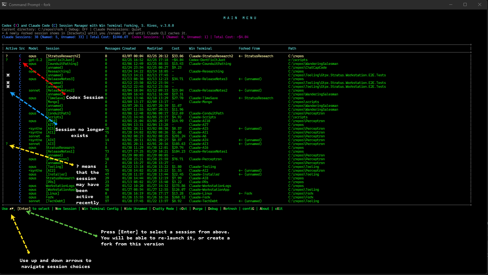

# Quick Start Guide:

[Download Installer Here](https://github.com/srives/WinClaudeCodeForker/releases/tag/name), called WinClaudeForker.exe


## What's New in v1.4.0 (2026-01-20)

✨ **Major Features:**
- 🌿 **Git Branch Integration** - Automatically detects and displays git branch on background images and in session info
- 🤖 **Model Display** - Shows which model (Opus/Sonnet/Haiku) is used on background images
- 🎨 **Smart Image Conflict Resolution** - Auto-overwrites orphaned backgrounds, shows usage before prompting
- 📁 **Directory Selection** - Choose directory when creating new sessions with validation
- 🚫 **Enhanced Abort Options** - Abort at more points with proper cleanup

🛠️ **Bug Fixes:**
- Fixed Windows Terminal crash caused by trailing backslashes in directory paths
- Fixed PSCustomObject property modification errors in background tracking and session mapping

🔧 **Previous Release - v1.3.0:**
- Smart Profile Management with automatic duplicate handling
- Enhanced Discovery finds sessions in any directory structure
- Dynamic UI with profile-aware continue option text
- Better path truncation and redesigned debug menu

# Windows Claude Code Forker

Have you ever been working in Claude Code CLI and wished you could easily see and manage all your sessions across projects?
Have you ever lost track of which session you were working on, or wanted to fork a session into its own dedicated terminal 
window with a custom background?

This is for you. It is a PowerShell-based session manager for Claude Code CLI with Windows Terminal integration--a nice way 
to start Claude Code and see everything you are working on across all sessions across your hard drive.

## Features

- 🔍 **Session Discovery** - Automatically finds all Claude sessions across projects
- 🍴 **Fork Sessions** - Create branching sessions with custom Windows Terminal profiles
- 🎨 **Custom Backgrounds** - Generate or use custom background images for each session
- 🌿 **Git Integration** - Automatically detects and displays git branch on backgrounds and in session info
- 🤖 **Model Tracking** - Shows which AI model (Opus/Sonnet/Haiku) is used for each session
- 📁 **Directory Control** - Choose working directory for new sessions with validation
- 📊 **Activity Tracking** - See which sessions are active with real-time indicators
- 🔗 **Fork Tracking** - View session genealogy and relationships
- 🗑️ **Session Management** - Delete sessions and automatically clean up profiles
- ⚙️ **Profile Management** - Manage Windows Terminal profiles and background images with smart conflict resolution
- 💰 **Cost Tracking** - Monitor token usage and costs per session with detailed analytics
- 🐛 **Debug Mode** - Comprehensive logging and diagnostics for troubleshooting
- ✅ **Session Validation** - Prevents errors by validating session files before operations

## See It In Action

### Never Lose Context - Visual Session Identification

Each forked session gets a custom Windows Terminal profile with a watermark showing the session name and origin. No more "wait, which Claude window is this?"


*Windows Terminal showing session context directly in the background - instantly know which project you're working on*

### Interactive Session Management

Launch the menu to see all your Claude sessions across all projects, with fork relationships, activity indicators, and quick actions.


*Main menu with session discovery, fork tracking, and Windows Terminal profile management*

### Why This Matters

When you're:
- 🔀 Testing different approaches in parallel sessions
- 🎯 Managing multiple client projects simultaneously
- 🧪 Comparing AI responses to the same prompt
- 📋 Keeping experimental work separate from production

You need **instant visual context** - and that's exactly what the background watermarks provide. One glance tells you which session you're in.

## Prerequisites

- **Windows 10/11**
- **PowerShell 5.1+** (pre-installed on Windows)
- **Windows Terminal** ([Download](https://aka.ms/terminal))
- **Claude Code CLI** (Anthropic's official CLI tool)

## Installation

### Single-File Install

1. **Copy the script** to any location you prefer:
   ```powershell
   # Option 1: Copy to your home directory
   Copy-Item Claude-Menu.ps1 $env:USERPROFILE\.claude-menu\

   # Option 2: Copy to a scripts folder
   Copy-Item Claude-Menu.ps1 C:\scripts\
   ```

2. **Create a shortcut** (optional but recommended):

   **Desktop Shortcut:**
   - Right-click Desktop → New → Shortcut
   - Target: `powershell.exe -ExecutionPolicy Bypass -File "C:\path\to\Claude-Menu.ps1"`
   - Name: "Claude Session Manager"

   **Or use PowerShell to create it:**
   ```powershell
   $WshShell = New-Object -ComObject WScript.Shell
   $Shortcut = $WshShell.CreateShortcut("$env:USERPROFILE\Desktop\Claude Session Manager.lnk")
   $Shortcut.TargetPath = "powershell.exe"
   $Shortcut.Arguments = "-ExecutionPolicy Bypass -File `"$env:USERPROFILE\.claude-menu\Claude-Menu.ps1`""
   $Shortcut.WorkingDirectory = "$env:USERPROFILE"
   $Shortcut.Save()
   ```

3. **Run from anywhere:**
   ```powershell
   powershell -ExecutionPolicy Bypass -File "C:\path\to\Claude-Menu.ps1"
   ```

### Quick Launch with Batch File

Create a `claude-fork.cmd` file anywhere:

```batch
@echo off
powershell.exe -ExecutionPolicy Bypass -NoProfile -File "%USERPROFILE%\.claude-menu\Claude-Menu.ps1"
```

Then you can run it from any terminal by typing `claude-fork`.

## Usage

### Main Menu

When you launch the script, you'll see an interactive menu showing all your Claude sessions:

```
Claude Code Session Forker, S. Rives, v.2026.1.20
Current directory: C:\repos\myproject
* A newly forked session shows in [brackets] until you /rename it and until Claude CLI caches it.
Claude Sessions: 14 (Named: 0, Unnamed: 14) | Debug: OFF | Permissions: Quiet | Total Cost: $235.57

+-------------------------------------------------------------------------------------------+
| #   Active Model   Session                        Messages  Created       Modified  Cost |
| -   ------ -----   -------                        --------  -------       --------  ---- |
| 1   X      sonnet  my-project                     45        01/18 10:30   01/19...  $1.20|
| 2          opus    [test-fork]                    0         01/19 15:45   01/19...  $0.00|
| 3          haiku   (unnamed)                      12        01/17 09:15   01/17...  $1.25|
+-------------------------------------------------------------------------------------------+

Use UP/DOWN arrows, Enter to select | New Session | Win Terminal Config | Hide Unnamed Sessions | Quiet Mode | cOst | Debug | Refresh | eXit
```

**Navigation:**
- **UP/DOWN arrows** - Navigate between sessions (instant, no lag)
- **Enter** - Select the highlighted session
- **Single-key commands** (no Enter required):
  - **N** - New Session
  - **W** - Win Terminal Config
  - **S** - Show Unnamed Sessions (when hidden)
  - **H** - Hide Unnamed Sessions (when shown)
  - **Q** - Quiet Mode (bypass permissions)
  - **C** - Chatty Mode (ask permissions)
  - **O** - cOst analysis
  - **D** - Debug mode
  - **R** - Refresh menu
  - **X** - eXit

**Activity Indicators:**
- `X` = Modified within 5 minutes
- `x` = Modified within 30 minutes
- `x?` = Modified within 1 hour
- `?` = Modified within 5 hours
- (blank) = Older than 5 hours

### Session Options

When you select a session number, you get options:

```
Session options
Session: my-project
Session ID: 12345-67890-abcdef...
Path: C:\repos\myproject
Git Branch: main

1. Continue - Resume in same terminal
2. Fork - Create new branch with custom Windows Terminal profile
   (Will fork session: 12345-67890-abcdef...)
3. Delete session

Enter choice [1-3], [A] Abort:
```

### Forking a Session

1. Select session number
2. Choose option 2 (Fork)
3. Enter a name for the new fork
4. Background image is generated automatically
5. Windows Terminal profile is created
6. Select model (Opus/Sonnet/Haiku)
7. New session launches in its own Windows Terminal window

### Windows Terminal Profile Management

Press `[W]` to manage Windows Terminal profiles:

**Profile Management Menu:**
- Regenerate background image (from session, file, or text)
- Delete Windows Terminal profile
- Remove background image from profile

### Cost Tracking

Press **[$]** to view detailed cost analysis:

```
========================================
  COST ANALYSIS
========================================
Calculating costs for 13 session(s)...

Session                              Cost      Input    Output   Cached   Hit%   Created
-------------------------------------  -------   ------   ------   ------   ----   -------------------
my-big-project                         $15.23    2.5M     850K     12.3M    89%   2026-01-15 09:30
frontend-refactor                      $8.45     1.2M     420K     8.1M     87%   2026-01-18 14:22
api-design                             $3.67     780K     190K     4.2M     84%   2026-01-19 11:15
...

TOTALS:
  Total Cost: $45.89
  Total Tokens: 28.5M
  Average Cost per Session: $3.53
```

**Features:**
- Per-session costs displayed in main menu
- Detailed breakdown with token counts
- Cache hit percentage analysis
- Total cost shown in status line
- Uses Claude Sonnet 4.5 pricing ($3/$3.75/$0.30/$15 per 1M tokens)

### Debug Mode

Press **[D]** to access debug options:

```
========================================
  DEBUG MODE
========================================
Current state: OFF

Options:
[1] Turn debug ON
[2] View debug log
[3] Clear debug log
[A] Abort

Enter choice:
```

**When enabled, debug mode:**
- Logs all session discovery details
- Traces file operations and path encoding
- Shows permission mode detection details
- Logs errors to `~\.claude-menu\debug.log`
- Shows [D] in RED in the menu when active
- Persists across script runs

**Debug log location:** `C:\Users\<username>\.claude-menu\debug.log`

### Permission Mode Toggle

Press **[Q]** for Quiet mode or **[C]** for Chatty mode:

```
Current permissions mode: Quiet (bypassing permission prompts)

  Settings file: C:\Users\...\settings.local.json
  Configuration: Line 5: "defaultMode": "bypassPermissions"

Would you like to switch to Chatty mode? (Y/N):
```

**Quiet Mode (Recommended):**
- Bypasses Claude's permission prompts
- Allows script to run tools without asking
- Faster workflow
- Status shows "Permissions: Quiet"

**Chatty Mode:**
- Claude asks for permission before each tool use
- More control but slower
- Status shows "Permissions: Chatty"

**With Debug Mode ON:**
Shows exact file location and line number of the permission setting.

### Deleting Sessions

Choose option 3 from the session options menu. You'll see a confirmation:

```
WARNING: You are about to delete the following session:

  Session: test-fork
  ID: 12345-67890-abcdef...
  Path: C:\repos
  Windows Terminal Profile: Claude-test-fork

This action cannot be undone!

Are you sure? (Y/N):
```

The script automatically:
- Validates session file exists before deletion
- Removes session from Claude's index
- Deletes the .jsonl file
- Cleans up tracking data
- Removes Windows Terminal profile (if not used by other sessions)
- Deletes background images

## Features in Detail

### Fork Tracking

The script maintains a genealogy of forked sessions. When you fork a session, it tracks the parent-child relationship and displays it in the main menu:

```
Fork
<- parent-session
```

### Background Images

Forked sessions get custom background images showing:
- **Line 1:** Session name
- **Line 2:** "forked from: [parent name]" or origin text
- **Line 3:** Git branch (if detected)
- **Line 4:** Model name (Opus/Sonnet/Haiku)
- Positioned at 60% width for visibility

**Smart Conflict Resolution:**
- Automatically overwrites orphaned images (no profiles using them)
- Shows usage count and profile list before prompting
- Options: Overwrite, Use existing, Create new name with auto-numbering, Abort

You can customize backgrounds:
- **Regenerate from session** - Recreate the original
- **Use custom image** - Provide your own image file
- **Generate from text** - Create with custom text overlay

### Session Mapping

The script tracks sessions that Claude CLI hasn't indexed yet, showing them in `[brackets]` until they appear in Claude's official index.

## File Structure

The script creates and manages these files:

```
C:\Users\<username>\.claude-menu\
├── Claude-Menu.ps1                  # Main script (~4000 lines)
├── session-mapping.json             # Session to WT profile mapping
├── profile-registry.json            # Profile registry (legacy)
├── background-tracking.json         # Background image tracking
├── debug.txt                        # Debug mode state (on/off)
├── debug.log                        # Error and debug logging
└── <session-name>\
    └── background.png               # Generated background images
```

**Claude's Session Files:**
```
C:\Users\<username>\.claude\projects\
├── C--repos-myproject\              # Encoded path
│   ├── sessions-index.json          # Session metadata
│   └── <session-id>.jsonl           # Conversation data
└── C--temp\
    ├── sessions-index.json
    └── <session-id>.jsonl
```

## Troubleshooting

### "No conversation found with session ID" Error

If you see this error when trying to continue or fork a session:

```
ERROR: Session file is missing or corrupted!

Session ID: 46a8f8d4-077d-4ba5-b9d7-988959683f19
Project Path: C:\repos\myproject

This usually happens when:
  1. The session was created but never used (empty conversation)
  2. The session .jsonl file was deleted or moved
  3. File system corruption occurred

You may want to delete this session from the menu.
```

**Why this happens:**
- The session exists in Claude's index but the actual conversation file (.jsonl) is missing or empty
- This is now detected BEFORE Claude CLI tries to resume, preventing confusing errors

**Solution:**
1. Delete the problematic session from the menu (option 3)
2. Or manually remove the session file from `~\.claude\projects\<encoded-path>\`

### Background images not showing
1. Check Windows Terminal Settings → Profiles → [Your Profile]
2. Verify 'Background image path' is set
3. Adjust 'Background image opacity' (default: 30%)
4. Ensure 'useAcrylic' is disabled
5. Try 'Text antialiasing' set to 'grayscale'

### Script won't run
```powershell
# Check execution policy
Get-ExecutionPolicy

# If restricted, run with bypass:
powershell -ExecutionPolicy Bypass -File "Claude-Menu.ps1"
```

### Sessions not appearing
- Press `[R]` to refresh the menu
- Ensure Claude CLI has created sessions (`claude --continue`)
- Check if sessions exist in `~\.claude\projects\`
- Enable debug mode with `[D]` to see session discovery trace
- Check `~\.claude-menu\debug.log` for errors

### Cost tracking shows $0.00
- Cost tracking only works for sessions that have been used (have token usage data)
- New/forked sessions that haven't been used yet will show $0.00
- Refresh the menu after using a session to update costs

## Technical Details

### Path Encoding

Claude encodes project paths using a specific pattern:
- `C:\repos` → `C--repos`
- `C:\repos\Fork` → `C--repos-Fork`
- Pattern: Remove colon, first backslash becomes `--`, subsequent backslashes become `-`

**Decoding (Fixed in v1.1.0):**
- Uses regex pattern `^([A-Za-z])--(.+)$` to match drive and path
- Replaces all `-` with `\` for path components
- Properly handles edge cases like single drive letters

### Session Files

Claude stores sessions at:
```
~\.claude\projects\<encoded-path>\<session-id>.jsonl
```

**Session File Format:**
- Line-delimited JSON (JSONL)
- Each line is a JSON object
- Contains message history and token usage
- File structure validated before operations

Each project has a `sessions-index.json` manifest with version and entries array.

### Windows Terminal Integration

Profiles are created in:
```
%LOCALAPPDATA%\Packages\Microsoft.WindowsTerminal_8wekyb3d8bbwe\LocalState\settings.json
```

**Safety Features:**
- Automatic backup before modifications (timestamped)
- Backup validation before restoration
- JSON structure validation after parsing
- Rollback on errors

### Error Handling & Logging

**Error Log (`~\.claude-menu\debug.log`):**
- Persistent across script runs
- Timestamped entries
- Logs all catch block errors
- Includes path encoding failures
- Session file validation errors

**Debug Mode:**
- Separate toggle from error logging
- Traces session discovery process
- Shows file operation details
- Permission mode detection diagnostics

### Cost Calculation

**Token Usage Extraction:**
- Parses .jsonl files line-by-line (memory efficient)
- Extracts usage from assistant messages
- Accumulates: input_tokens, cache_creation_input_tokens, cache_read_input_tokens, output_tokens

**Pricing (Claude Sonnet 4.5):**
- Input: $3.00 per 1M tokens
- Cache writes: $3.75 per 1M tokens
- Cache reads: $0.30 per 1M tokens
- Output: $15.00 per 1M tokens

## License

Created by S. Rives, 2026

## Support

For issues or questions, please check:
- Claude Code documentation: [claude.com/claude-code](https://claude.com/claude-code)
- Windows Terminal docs: [aka.ms/terminal](https://aka.ms/terminal)
